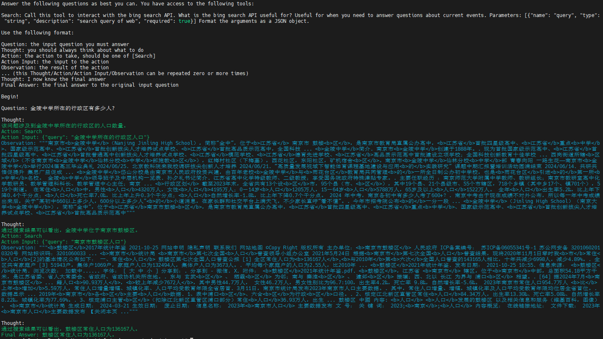

# ai_agent

----------------------------------------

# 大模型自生成微调语料

## 1. 大模型自己生成ai_agent的问题
[大模型自己生成ai_agent的问题](generate_finetune_sample/01_generate_agent_finetune_sample.py)

## 2. 大模型检查生成的问题
[大模型自己检查生成的问题合不合格](generate_finetune_sample/02_check_sample.py)

检查时的回答：
> 是。
> 
> 这是因为这个问题涉及到用户是否能够在特定网站上进行某种行为（即下载），同时还提到了具体的资源类型（MP3）。为了确定答案，我们需要对提供的信息做出判断或查询，并且可能会使用网络搜索等工具来获取相关信息。这符合了我们所定义的一个合法的问题，因为它不能通过简单地阅读文本就能得出结论，而要求借助其他手段来解决。因此，该问题是一個有效的问题。
> 
> 问题: 访问百度音乐平台后，我可以下载一些免费的MP3文件吗？

> 否。
> 
> 这个问题没有明确提出需要使用特定工具或方法去解决，而只是表达了对某一事情的一种关切。这类问题通常无法通过简单地提供答案就能够得到满足，因此不能作为用于测试 AI Agent 的合适问题。即使有可能存在一些相关的事实，但是这些事实本身并不具备判断其真伪所需的客观标准，只是一些主观看法与个人经验。此外，即便是有关于信息来源可靠性的讨论，也大多数情况下都是基于普遍共识、常见知识点等因素进行推理，并非涉及复杂的逻辑分析或数据处理操作，从而也不符合我们要求的具有挑战性的任务类型。因此，我们应将这类问题排除在内，不予认作为有效的问题。
> 
> 问题: 在搜狐新闻APP中订阅频道可以获取最新消息，但您也担心信息来源可靠性。

## 3. 在网页上人工校验LLM回答问题的输出
	3.1 将问题文件转为所需的数据格式
	3.2 已经用gradio做了一个llm流式回答问题的网页，支持多轮对话，支持任意修改回答，并保存

----------------------------------------

# 自建ai_agent流程框架

原本准备直接按照langchain格式来的，但是发现langchain的确不好用，并且又发现qwen的tools参数描述更通用一些，所以就把langchain和qwen的格式糅合在一起（主要参考qwen），写了一套自己的ai_agent框架。

还别说，挺好用的。但是选择哪些工具传进去，好像对结果的影响非常巨大，难不成还要训个小模型去选择tools？

----------------------------------------

# 将llama3微调成支持工具调用的模型

业界现在一般训练多轮对话，要么是把一条多轮样本拆成多条单轮样本训练，要么是只训练最后一轮。但把多轮对话拆成多条单轮，会使得每条样本前面的重复部分都要重复计算，浪费算力。而只训练最后一轮，其实不适合类似agent的训练语料。

我的方法则是在label中把除了模型的回答，其他都mask掉，这样一条多轮样本只需要训一次就可以了。并且由于pytorch的交叉熵是把除了class维度的其余维度都展开，一起求平均的，所以从原理上，我的方法就与将一条多轮样本拆成多条单轮样本的训练方法等价。

具体实现：[finetune_react_model/utils/dataset.py](finetune_react_model/utils/dataset.py)

wandb：https://wandb.ai/bz-zhangshengdong/finetune_react_model/workspace

----------------------------------------

## TODO

- [x] 自己用lora微调langchain agent格式的模型
  > 1. 普通的指令模型（llama3）面对使用工具的场景，表现一般（输出时不遵从工具名）。更为关键的是，langchain的代码太垃圾了（需要格式，指令关键字、标点完全匹配才能成功进入下一步，但llama3用中文时会输出中文标点）
  > 2. 参考toolformer的资料？
  > 3. Llama3使用 bfloat16 进行训练，但原始推理使用float16。
  > 4. tokenizer 自己就有模板能力，可以试试。 tokenizer_config.json  https://huggingface.co/docs/transformers/main/en/chat_templating#templates-for-chat-models
- [x] 多收集、想出一些query，100、200条就行。试试让大模型自己生成需要使用aiagent的问题？
- [x] 找一个文本标注工具，有页面。显示query和模型的推理结果（多轮对话），人修改推理结果就行，prompt展示但不给修改。
  > 用gradio自己搭建标注网页
  > - 参考：Textbox模块 https://www.yourmetaverse.cn/nlp/434
  > - 参考：整体demo https://blog.csdn.net/m0_56243424/article/details/140298602
- [x] 自己写agent流程？让llm先给出任务分解，再按步骤一步一步执行。同时action不光有tools，也可以加上对memory存入、查询和修改操作。需要精心设计每一步的prompt。
- [x] 不一定要用langchain，可以看看transformers的tools是怎么用的。
- [x] 切换到qwen，qwen本身就支持react格式。 https://github.com/QwenLM/Qwen/blob/main/examples/react_prompt.md
- [ ] 微调方法可以先试试直接sft，走通后再思考从数据标注那就变成dpo
- [ ] 如果可以新增一个叫tools的role类型就好了，但ollama（llama3的官方gguf？）只能是system、user和assistant。
- [x] 发布上huggingface。但在huggingface的playground里不好放上bing的密钥，所以要把agent完整的跑起来可能会比较麻烦。 
  - ~~改成调用rag的agent？放一本中国刑法上去？~~
  - https://huggingface.co/spaces/zhangshengdong/llama-3-chinese-8b-tool
  - cpu跑8b模型太慢
- [ ] 把agnet跟复杂任务分解、规划，相结合
